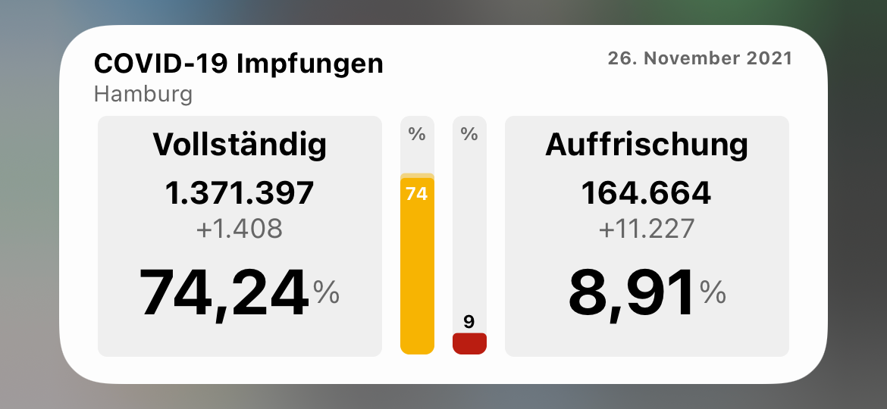
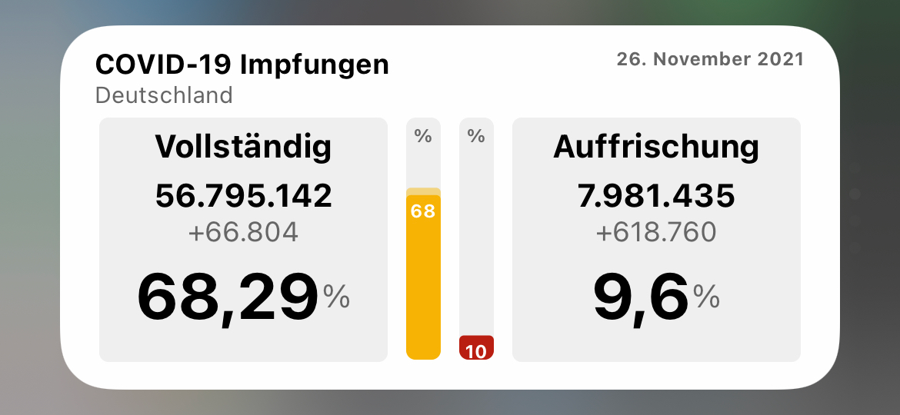

# ImpfQuoten, Ein Scriptable Widget
Ein Scriptable Widget zur Anzeige der gegen COVID-19 geimpften Personenzahl.
Die Quote der Geimpften mit Bezug auf die Bevölkerung von Deutschland oder eines gewählten Bundeslands.
Zusätzlich werden die Zahlen mit einem Fortschrittsbalken visualisiert. 
 &nbsp;   
  

## Verwendung

* Download Scriptable App für iOS Geräte - https://scriptable.app
* Download/Import der ImpfQuoten.js Datei nach iCloud/Scriptable
* Auf dem Homescreen ein neues mittleres Scriptable Widget erstellen - Parameter für Bundesland optional 
 &nbsp;   
Das Skript ist aktuell für die mittlere Widgetgröße ausgelegt und wurde auf einem iPhone 12Pro, Xs getestet.
Wird das Skript in einem kleinen Widget verwendet, wird die Anzeige auf die Erstimpfungen reduziert.
Auf anderen Geräten oder Widgetgrößen kann es ggf. zu Abweichungen in der Darstellung kommen.

## Features

* Quelle der Daten: https://rki-vaccination-data.vercel.app
* Als Basis der Quelle dient: https://www.rki.de/DE/Content/InfAZ/N/Neuartiges_Coronavirus/Daten/Impfquoten-Tab.html
* Über den Parameter des Widgets kann ein Bundesland vorgegben werden. Kürzel nach ISO 3166-2:DE
* Wechselt gemäß der Geräteeinstellung automatisch in den Darkmode
* Individuelle Farbstufen für die Impfquote: Rot = Step1st < 20%, Grün = Step2nd > 60%, Dazwischen Orange, Ziel = 70% Herdenimunität

## Kürzel für den Parameter des Widgets
BW = Baden-Württemberg 
BY = Bayern 
BE = Berlin 
BB = Brandenburg 
HB = Bremen 
HH = Hamburg 
HE = Hessen 
MV = Mecklenburg-Vorpommern 
NI = Niedersachsen 
NW = Nordrhein-Westfalen 
RP = Rheinland-Pfalz 
SL = Saarland 
SN = Sachsen 
ST = Sachsen-Anhalt 
SH = Schleswig-Holstein 
TH = Thüringen 

## Beispiele
 &nbsp;   
 &nbsp;  
## Bekannte Probleme

* Fortschrittsbalken wechselt nicht direkt in das zugehörige Erscheinungsbild (hell/dunkel)
* Tritt ein Fehler beim Datenabruf auf, wird eine Fehlermeldung angezeigt: 
  

## Changelog
* v1.1 Anzeige der Erstimpfungen als kleines Widget
* v1.0 Release GitHub

## Hinweis zur Quelle und Datenstand
Die Daten werden werktäglich aktualisiert und stehen hier öffentlich zur Verfügung:
https://www.rki.de/DE/Content/InfAZ/N/Neuartiges_Coronavirus/Daten/Impfquoten-Tab.html 
Es wird ebenfalls darauf hingewiesen, dass die Zahlen nachträglich korrigiert werden können.
Der Abruf erfolgt nicht direkt beim RKI sondern über einen kleinen Umweg: https://rki-vaccination-data.vercel.app  
